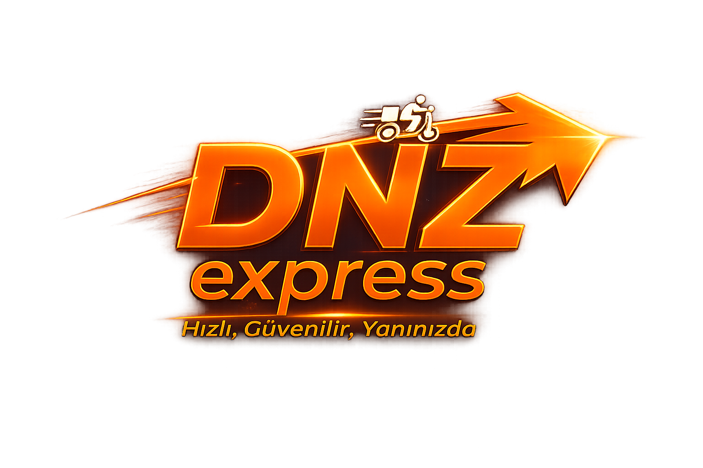

# DNZ Express — WordPress Delivery Theme

<div align="center">



**Premium, 3D İnteraktif, Glassmorphism WordPress Kurye Hizmetleri Teması**

[](https://wordpress.org)
[](https://php.net)
[](http://www.gnu.org/licenses/gpl-2.0.html)
[](https://github.com)

[🌐 Canlı Demo](http://www.dnzexpres.com) · [📖 Kurulum](#kurulum) · [✨ Özellikler](#özellikler)

</div>

---

## ✨ Özellikler

| Özellik | Açıklama |
|---|---|
| 🎨 **Glassmorphism Tasarım** | Frosted glass efektleri ile modern ve premium görünüm |
| 🌐 **3D Neural Network Animasyonu** | Hero bölümünde Canvas API ile gerçek zamanlı 3D simülasyon |
| 🏍️ **Motosiklet Animasyonu** | Form gönderiminde tetiklenen spektaküler 3D kurye animasyonu |
| 📱 **Tam Mobil Uyumlu** | Tüm ekran boyutlarında mükemmel görünüm |
| 🔒 **Güvenli Formlar** | CSRF koruması, honeypot spam filtresi, IP bazlı rate limiting |
| 📝 **WordPress Blog** | WP Admin panelinden yönetilebilir tam blog sistemi |
| 🔗 **Related Posts** | Blog yazılarının altında aynı kategoriden önerilen yazılar |
| ⚙️ **WP Customizer** | Renk, logo, iletişim bilgisi, hero içeriği admin panelinden değiştirilebilir |
| 💬 **AJAX Formlar** | Sayfa yenilemeden anlık form gönderimi ve başarı animasyonu |
| 📊 **Animasyonlu İstatistikler** | Sayfa kaydırıldığında tetiklenen sayaç animasyonları |
| 🌙 **Dark Mode** | Tamamen koyu, göz yormayan premium dark tema |
| 📦 **Çoklu Sayfa Şablonu** | Her form sayfası için ayrı, özel WordPress şablon dosyaları |

---

## 📸 Ekran Görüntüleri

> Canlı önizleme için: **[http://www.dnzexpres.com](http://www.dnzexpres.com)**

---

## 🗂️ Dosya Yapısı

```
dnz-theme/
│
├── 📄 style.css                          # Tema bilgileri + tüm CSS stilleri
├── 📄 functions.php                      # Tema fonksiyonları, script yükleme
├── 📄 front-page.php                     # Ana sayfa (Hero, Hizmetler, İstatistikler, CTA)
├── 📄 home.php                           # Blog listesi
├── 📄 single.php                         # Tek blog yazısı + ilgili yazılar
├── 📄 archive.php                        # Kategori/etiket arşiv sayfası
├── 📄 page.php                           # Genel sayfa şablonu
├── 📄 404.php                            # Hata sayfası
├── 📄 header.php                         # Site başlığı ve navigasyon
├── 📄 footer.php                         # Site altbilgisi, sosyal medya, WhatsApp butonu
│
├── 📁 inc/
│   ├── 📄 form-handlers.php              # AJAX form işleme, e-posta gönderimi
│   └── 📄 customizer.php                 # WP Tema Özelleştirici ayarları
│
├── 📁 assets/
│   ├── 📁 js/
│   │   ├── 📄 main.js                    # Animasyonlar, form validasyon, AJAX
│   │   └── 📄 3d-simulation.js           # Canvas neural network simülasyonu
│   └── 📁 img/                           # Logo ve görseller
│
└── 📄 page-*.php                         # Özel sayfa şablonları:
    ├── 📄 page-bize-ulasin.php           # İletişim formu
    ├── 📄 page-kurye-olmak-istiyorum.php # Kurye başvuru formu
    ├── 📄 page-is-ortagi-ol.php          # İş ortağı formu
    └── 📄 page-hizmetlerimiz.php         # Hizmetler sayfası
```

---

## ⚡ Kurulum

### 1. Temayı Yükle

**Yöntem A — WordPress Admin Paneli (Önerilen):**
1. [Releases](https://github.com) sayfasından `dnz-theme.zip` dosyasını indir.
2. **WP Admin → Görünüm → Temalar → Yeni Ekle → Tema Yükle** yolunu izle.
3. ZIP dosyasını yükle ve **Etkinleştir**.

**Yöntem B — FTP / cPanel:**
```bash
# Bu klasörü sunucuya yükle:
/wp-content/themes/dnz-theme/
```

### 2. Sayfaları Oluştur

WP Admin → **Sayfalar → Yeni Ekle** kısmından aşağıdaki sayfaları oluştur ve her birine sağ panelden ilgili **Şablon**'u seç:

| Sayfa Adı | Slug | Şablon |
|---|---|---|
| Hizmetlerimiz | `hizmetlerimiz` | Hizmetlerimiz |
| Bize Ulaşın | `bize-ulasin` | Bize Ulaşın |
| Kurye Olmak İstiyorum | `kurye-olmak-istiyorum` | Kurye Olmak İstiyorum |
| İş Ortağı Ol | `is-ortagi-ol` | İş Ortağı Ol |
| Blog | `blog` | *(Şablon seçme)* |

### 3. Blog Sayfasını Tanıt

**Ayarlar → Okuma** kısmına git:
- **Giriş sayfası:** Ana Sayfa'yı seç
- **Yazılar sayfası:** Blog'u seç
- Kaydet.

### 4. Menüyü Kur

**Görünüm → Menüler** kısmından bir menü oluşturup **"Primary Menu"** konumuna ata.

### 5. Form E-Postasını Ayarla

Form başvurularının gideceği e-posta adresini ayarlamak için:\
**Görünüm → Tema Dosya Düzenleyici → inc/form-handlers.php** dosyasını aç.\
38. satırdaki kodu bul ve kendi adresini yaz:
```php
$to = 'senin@emailin.com';
```

### 6. WP Mail SMTP Kur (Önerilen)

E-postaların spama düşmemesi için **WP Mail SMTP** eklentisini kur ve SMTP bilgilerini gir.

---

## 🔒 Güvenlik Özellikleri

- ✅ `wp_nonce_field()` ile **CSRF koruması**
- ✅ Honeypot alanı ile **bot/spam koruması**
- ✅ IP bazlı **rate limiting** (30 saniyede 1 gönderim)
- ✅ `sanitize_text_field()` / `sanitize_email()` ile **input temizleme**
- ✅ `ABSPATH` kontrolü ile **doğrudan erişim engeli**

---

## 🛠️ Önerilen Eklentiler

| Eklenti | Amaç |
|---|---|
| **WP Mail SMTP** | Form e-postalarının güvenli iletimi |
| **Yoast SEO** | Arama motoru optimizasyonu |
| **LiteSpeed Cache** | Performans ve hız |
| **WPS Hide Login** | Admin panel güvenliği |

---

## 📋 Gereksinimler

- WordPress **5.9** veya üzeri
- PHP **7.4** veya üzeri
- Mod Rewrite aktif (WordPress kalıcı bağlantıları için)

---

## 📄 Lisans

Bu tema [GNU General Public License v2](http://www.gnu.org/licenses/gpl-2.0.html) lisansı altında dağıtılmaktadır.
> Logo veya markaya ait bilgileri kullanmayınız

---

<div align="center">

**DNZ Express © 2026 — [dnzexpres.com](http://www.dnzexpres.com)**

Tema geliştirme: [themafis](https://github.com/themafis)

</div>
